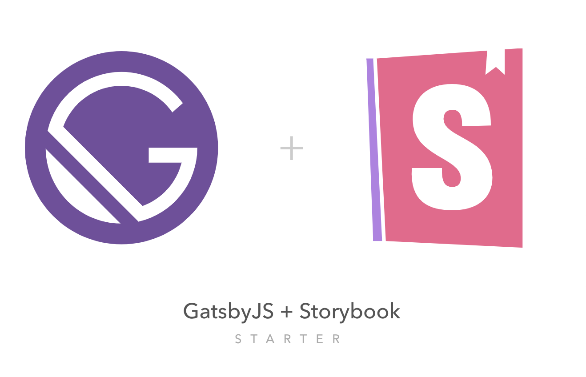

<p align="center">
  <a href="https://www.gatsbyjs.org">
    
  </a>
</p>
<h1 align="center">
  GatsbyJS + Storybook Starter
</h1>
<p align="center">
  Gatsby starter that uses Storybook + additional set of tools listed bellow, and provides an easy to start structure to get you up and running with your Gatsby powered site.
</p>

##  What's inside?

- Gatsby (v2)
- Storybook (v5)
- Styled Components (v4)
- Styled Reset (Advanced)
- Netlify Conf
- Eslint

## Quick start
```bash
$ gatsby new my-awesome-site https://github.com/markoradak/gatsby-starter-storybook

$ cd my-awesome-site
$ yarn start || yarn develop
```

## Deploy

[](https://app.netlify.com/start/deploy?repository=https://github.com/markoradak/gatsby-starter-storybook)

## License

Licensed under the MIT License, Copyright © 2018 Marko Radak.  
See [license](LICENSE) for more information.
